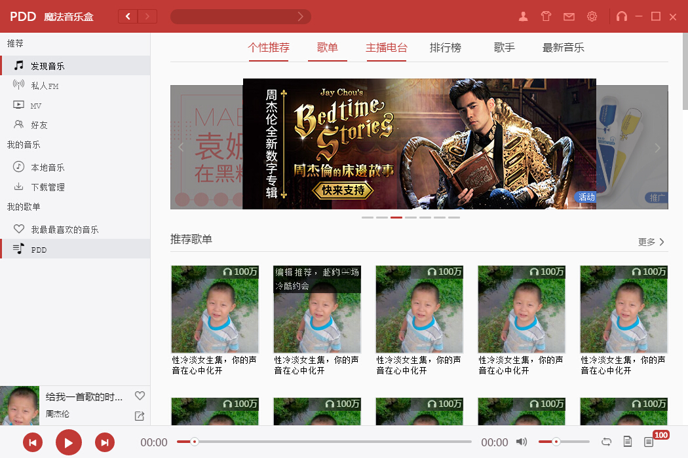

# show

# Tech
- [x] view层框架 react
- [x] app run platform = electron(运行环境electron)
- [x] data state manager = redux(数据状态管理框架redux)
- [x] es6 transform to es5 = babel(低版本语法转换工具babel)
- [x] dev tools use webpack(开发工具webpack)
- [x] css 样式骨架布局尝试用flex
- [x] 开发过程中使用scss,由scss-loader转换成css
- [x] 数据库使用的是lowdb
- [x] 音频播放的两种实现方式 html5 audio标签   或者是AudioContext自行截取播放(对音频研究比较深的人适合)
- [x] 发现js中进程是不能sleep的    java中可以sleep是因为主进程可以执行唤醒操作  但是js中就只有主进程本身,本身处于睡眠状态执行唤醒本身相互矛盾
- [x] 所以async 的await只是延缓或者设定callback  而不是让进程等待await所以本质上是控制callback
- [x] 所以在初始化的时候从数据库获取数据本身就是异步

# Point
- [x] 保证store的唯一性  使用了electron-restore依赖库
- [x] 发现他有的是兼顾了透明和显示完全  那应该不是用opacity
- [x] 数据库用的nedb  查询结果为对象数组  在编码方便需要转换..
- [x] 加载本地mp3时 audio.src = path  之后audio监听事件 loadedmetadata 此时可以通过audio.duration获取时间长度

# source from web
- [x] flexbox布局 http://www.w3cplus.com/css3/css3-flexbox-layout.html  存在兼容性问题 慎用
- [x] 图标素材来源   http://iconfont.cn/  牛逼的阿里爸爸
- [x] 关于h5中 audio标签的详细解析  http://www.w3school.com.cn/jsref/dom_obj_audio.asp
- [x] AudioContext播放音频  http://www.cnblogs.com/Wayou/p/3543577.html
- [x] 关于解析歌词   http://blog.csdn.net/yorhomwang/article/details/42300743
- [x] ID3 400star https://github.com/aadsm/JavaScript-ID3-Reader
- [x] id3js 280star https://github.com/43081j/id3

# Features
- [x] 搭建开发环境 webpack+electron+react+redux+lowdb(主要组成部分)
- [x] 使用flex布局 纵向内嵌横向  自适应良好
- [x] header部分ui
- [x] leftpart部分ui
- [x] 拆分完成进度条组件  bootstrap and flatui has it,but it's too heavy
- [x] 主面板值发现音乐模块的ui
- [x] 完成轮播组件
- [ ] 播放列表控制
- [ ] 前后翻页组件
- [ ] 获取mp3文件的附带信息  比如专辑  歌手 歌词
- [ ] 同时加载本地多个音乐文件,  过滤  1.是否为音乐文件  2.音乐文件的详细信息 长度 时间 作者 图片  3.存储进本地音乐库 4.更新store  更新视图
- [ ] 

# Declaraction 
- [x] 此项目从UI风格上模仿网易云  并未抄袭  况且抄不到  打包加密混淆估计它都用了  
- [x] 数据获取网易云进行了加密,获取不到  我是借用酷我音乐的api  酷我万岁
- [x] 图片素材来自于阿里巴巴  开放且高质量

# Author
- [x] PDD
- [x] 1575455507@qq.com
- [x] 张椿木

# mood
- [x] 最痛苦的事情就是写样式   so terrible
- [x] 有点心烦 今天代码就少了点

# License
  MIT 

