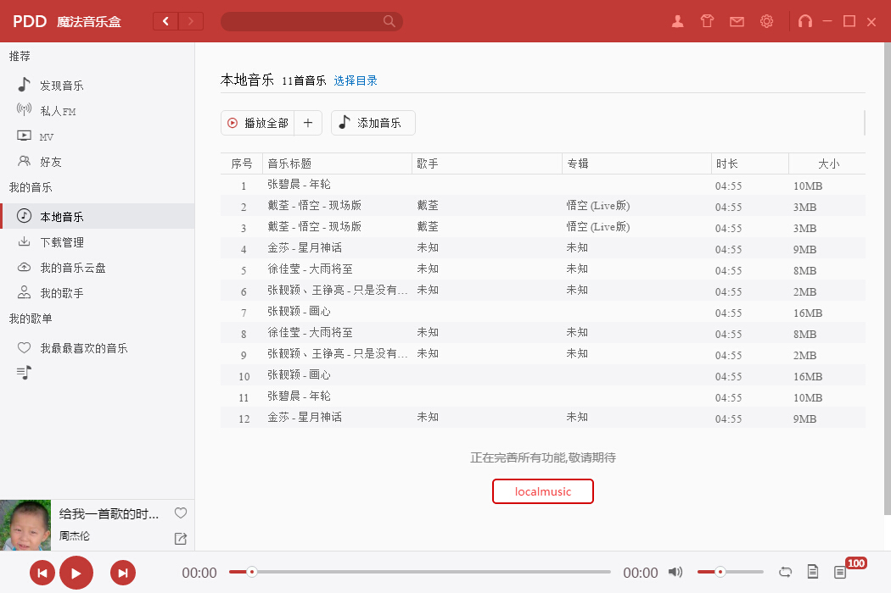

# show

# Tech
- [x] view层框架 react
- [x] app run platform = electron(运行环境electron)
- [x] data state manager = redux(数据状态管理框架redux)
- [x] es6 transform to es5 = babel(低版本语法转换工具babel)
- [x] dev tools use webpack(开发工具webpack)
- [x] css 样式骨架布局尝试用flex
- [x] 开发过程中使用scss,由scss-loader转换成css
- [x] 数据库使用的是lowdb
- [x] 音频播放的两种实现方式 html5 audio标签   或者是AudioContext自行截取播放(对音频研究比较深的人适合)

# Point
- [x] 保证store的唯一性  使用了electron-restore依赖库
- [x]  发现他有的是兼顾了透明和显示完全  那应该不是用opacity

# source from web
- [x] flexbox布局 http://www.w3cplus.com/css3/css3-flexbox-layout.html  存在兼容性问题 慎用
- [x] 图标素材来源   http://iconfont.cn/  牛逼的阿里爸爸
- [x] 关于h5中 audio标签的详细解析  http://www.w3school.com.cn/jsref/dom_obj_audio.asp
- [x] AudioContext播放音频  http://www.cnblogs.com/Wayou/p/3543577.html

# Features
- [x] 搭建开发环境 webpack+electron+react+redux+lowdb(主要组成部分)
- [x] 使用flex布局 纵向内嵌横向  自适应良好
- [x] header部分ui
- [x] leftpart部分ui
- [x] 拆分完成进度条组件  bootstrap and flatui has it,but it's too heavy
- [x] 主面板值发现音乐模块的ui
- [x] 完成轮播组件
- [ ] 播放列表控制
- [ ] 前后翻页组件

# Declaraction 
- [x] 此项目从UI风格上模仿网易云  并未抄袭  况且抄不到  打包加密混淆估计它都用了  
- [x] 数据获取网易云进行了加密,获取不到  我是借用酷我音乐的api  酷我万岁
- [x] 图片素材来自于阿里巴巴  开放且高质量

# Author
- [x] PDD
- [x] 1575455507@qq.com
- [x] 张椿木

# License
  MIT 

